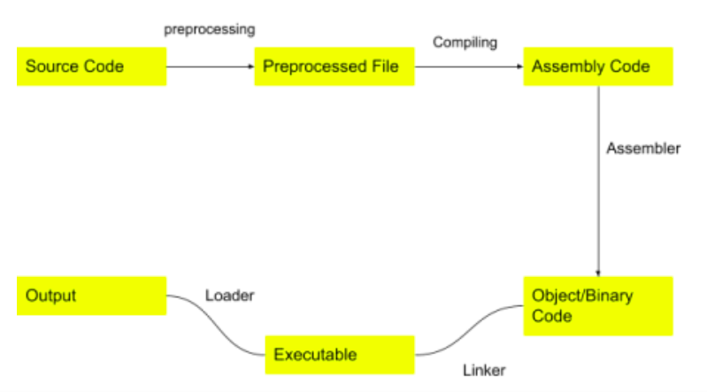

This lab is to just to checkout the intermediate steps and files being produced during compilation of a sample C program

-----------------

<div align="center">
    
</div>

-----------------

Command to generate immediate files for a test.c program
```
gcc -Wall --verbose --save-temps -o first-exec test.c
chmod 777 first-exec
./first-exec 
```
