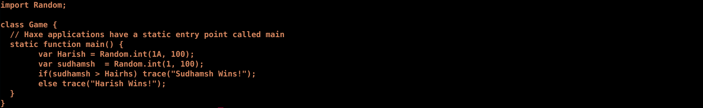
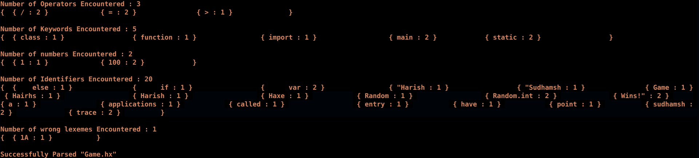

This lab aims to generate tokens for lexemes producing keywords, identifiers, numbers etc...

- Input (Game.hx)
<div align="center">
    
</div>

<br>

We use a input file (Game.hx) which contains a sample program written in an pre-assigned language, on which we perform lexical analysis.
```
g++ LexicalAnalyser.cpp -o Lexi
chmod 777 Lexi
./Lexi Game.hx >& output
```

- Output
<div align="center">
    
</div>
