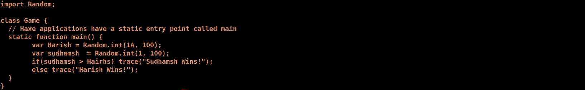

This lab involves implementing lexical analysis using [LEX](http://dinosaur.compilertools.net/)

Installation
```
sudo apt-get install bison flex
```

- Input (Game.hx)
<div align="center">
    
</div>

<br>

We use a input file (Game.hx) which contains a sample program written in an pre-assigned language, on which we perform lexical analysis.
```
flex lex.cpp
g++ lex.yy.c -ll -o main
./main Game.hx >& output
```
- Lex Rules
<div align="center">
    
</div>

- Output
<div align="center">
    
</div>
