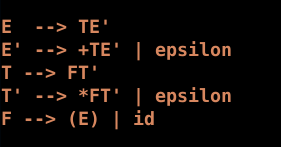
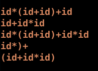
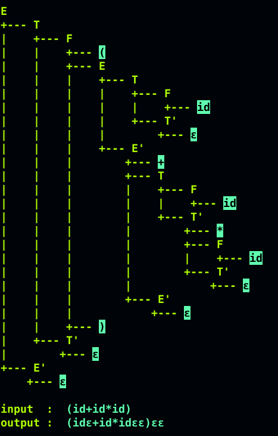

This lab involves implementing a recursive descent top down parser

- Grammar
<div align="center">
    
</div>

- Input
<div align="center">
    
</div>

<br>

We implement a tree implementation which simulates the backtracking and parse tree generation
```
g++ recursiveDescent.cpp -o recDes
./recDes input
```

- Output
<div align="center">
    
</div>

<br>

Use the color_recursiveDescent.cpp if your terminal supports [term256](https://github.com/gawin/bash-colors-256) colours.
