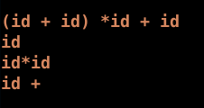
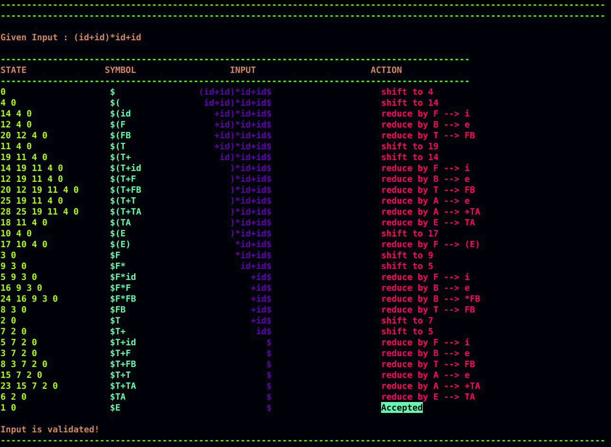

This lab involves implementing a canonical LR parser

- Grammar
<div align="center">
    
</div>

- Input
<div align="center">
    
</div>

<br>

We use a stack implementation
```
g++ canonicalLRParser.cpp -o clp
./clp input.txt
```

- Output
<div align="center">
    
</div>

<br>

Use the color_canonicalLRParser.cpp if your terminal supports [term256](https://github.com/gawin/bash-colors-256) colours.
